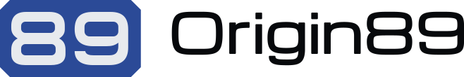

<picture>
  <source media="(prefers-color-scheme: dark)" srcset="logos/origin89-horizontal-white.svg">
  
</picture>

# Origin89 brand

The Origin89 identity, published as `@origin89/brand`. The website, the docs
site, Buddy and the app install it and read the same colours, logos and fonts.

## Use it

```sh
npm i @origin89/brand
```

```js
import brand from "@origin89/brand";          // names, both colour themes, typography, file manifest
import "@origin89/brand/tokens/themes.css";   // every token as a custom property, both themes, switching wired
import "@origin89/brand/tokens/tailwind.css"; // the Tailwind @theme block, dark literals
```

Files are addressed by their path in the manifest:
`@origin89/brand/logos/origin89-horizontal-blue.svg`,
`@origin89/brand/fonts/InterTight-600.ttf`.

## What is here

| Path | Contents |
| --- | --- |
| `identity/` | The kit as it is made: logo and wordmark geometry with the vector builders in `source/`, the outlined logos as SVG and PNG, icons, fonts with their OFL files, the token exports, the design guide as Markdown and PDF, and the Blender studio for the plate. |
| `buddy/` | The Buddy character: `blender/buddy.blend` and the scripts that build, verify and render it, the hand-set face scene, the presentation renders the products use, the avatar builder and the references. Studies and review renders are not kept here. |
| `situations/` | Editable Buddy scenes and their build scripts: Reserve at a site, and the equipment scout holding binoculars for the Data page. |
| `source/` | `buddy.py`, the driver for rebuilding the character, its presentation renders and avatars. Needs Blender. |
| `palette/` | The 20 colour tokens, their light and dark values, and why each one exists. The only place a colour is written. `verify.mjs` measures every value against the contrast floor it claims. |
| `logos/`, `icons/`, `fonts/`, `tokens/`, `brand.json` | The published package, generated by `build.mjs` from `identity/` and `palette/` and committed. The manifest names every shipped file with its SHA-256 and where it came from. |

`npm run check` rebuilds the package, runs the contrast check, fails on any
difference from what is committed, and builds the kit zip. CI runs it on every
push.

Blender files travel through Git LFS: the character, its face scene, the plate
studio, the reserve scene and the equipment scout. Clone with
`GIT_LFS_SKIP_SMUDGE=1` unless you are editing them; CI never fetches them.
The four scene variants under `buddy/presentation/` are written by
`python3 source/buddy.py presentation` from the character and are not
committed.

## The kit

Every release attaches `origin89-brand-kit.zip`: the logos as SVG and PNG, the
icons, the fonts with their licences, the colour tokens as CSS and JSON, the
design guide and the terms. The guide is attached on its own as well. The
latest of each is always at

- https://github.com/origin89hq/brand/releases/latest/download/origin89-brand-kit.zip
- https://github.com/origin89hq/brand/releases/latest/download/origin89-design-guide.pdf

which are the links the website uses.

## Release

Bump `version` in `package.json`, run `npm run check`, commit, then push a
tag named `brand-v<version>`. The workflow checks the tag against the version,
rebuilds, refuses a dirty tree, publishes the package through npm trusted
publishing and attaches the kit to a GitHub release. No token is stored in
this repository.

## Terms

The marks and artwork are not open source. [LICENSE.md](LICENSE.md) says what
you may do with them without asking. The palette, the scripts and the manifest
are MIT OR Apache-2.0. The fonts are OFL.
