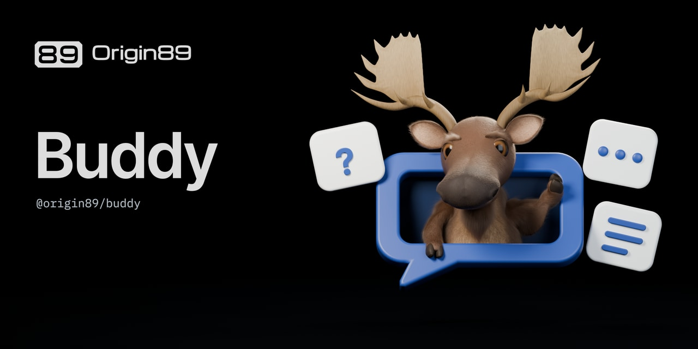

# Buddy chat



Buddy social artwork for the assistant and `@origin89/buddy`. The scene derives
from `buddy/blender/buddy.blend` and the approved materials in
`buddy/presentation/face-front.blend`. Their hashes are checked before and after
rendering. The character's geometry, rig, facial controls, and groom are preserved.

## Editable source

Open `scene.blend` in Blender 5.2 and press F12. The image renders directly from
the live character, native props, lighting, and branding. Fonts are packed;
the scene has no raster character layer or generated background plate.

- `Chat | editable bubble and cards` contains the extruded speech-bubble frame,
  backing, three card bodies, question text, dots, and answer strokes.
- `Buddy | pose rig` retains the armature and facial controls. This is a static
  explanatory pose with one raised hoof and one resting over the lower frame.
- `Chat | waist reveal height` controls a shader mask below the bubble. It hides
  the lower body without deleting or changing the character's geometry.
- `Brand | editable logo and text` contains curves derived from the original
  wordmark SVG and editable title/package text using packed Inter Tight and
  IBM Plex Mono fonts. Branding follows the camera.
- The camera, native floor, and studio lights remain editable scene objects.

`scene.blend` is tracked through Git LFS. Keep it and the scripts together.
Shared character changes belong in the canonical Buddy source; this derivative
owns its pose, props, framing, and lighting.

## Exports and rebuild

- `buddy-social.png`: 2560 × 1280 master render.
- `buddy-social.jpg`: 1280 × 640 JPEG under 1 MB, ready for GitHub social preview.
- `../../../art/buddy-social.webp`: 1280 × 640 package export for web and README use.
- `scene.json`: source hashes, render settings, camera framing, and export hashes.

From the repository root:

```sh
git lfs pull --include="buddy/blender/buddy.blend,buddy/presentation/face-front.blend,situations/scenes/buddy-chat/scene.blend" --exclude=""
blender -b --python-exit-code 1 --python situations/source/build_buddy_chat.py -- --width 2560 --samples 192
node situations/source/export_buddy_chat.mjs
just check
```

The builder recreates the scene. Keep persistent recipe changes in
`situations/source/build_buddy_chat.py` and `situations/source/chat_geometry.py`;
save manual Blender edits separately before rebuilding. A quick draft writes
only to ignored `.build/buddy-chat/`:

```sh
blender -b --python-exit-code 1 --python situations/source/build_buddy_chat.py -- --draft --width 1280 --samples 48
```

Ordinary package checks use the committed master PNG and do not invoke Blender.
Consumers can import `@origin89/brand/art/buddy-social.webp` after a package
release containing this asset. The marks, artwork, and fonts retain the terms
in the repository's `LICENSE.md` and `fonts/*-OFL.txt`.
