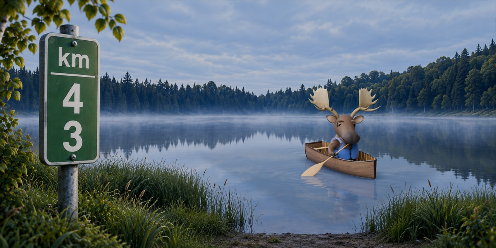

# KM43 canoe



The real Buddy character is rendered from `buddy/blender/buddy.blend` using the
approved materials from `buddy/presentation/face-front.blend`. The pose changes;
the original face, antlers, fur, body geometry, and rig remain the shared source.

The KM43 marker and cottage shoreline lead the composition. Buddy is a smaller
secondary detail out on the lake, seated in the middle of his canoe, with its
heading turned toward his gaze and the viewer.
The flat stern remains visible on the left and the pointed bow faces right.
The scene has editable cedar strips, bent ash ribs, brass fasteners, a carved
ash paddle, a fitted fabric life vest, outdoor lights, and native water with
reflections and paddle ripples. The lake, shoreline, and green marker are a
generated 2D plate inspired by the user's cottage photographs. They are not an
exact reconstruction or a photograph of the site. The plate and its generation
prompt are in `assets/`; the user's private screenshots are not included.

## Files

- `km43-social.png`: 2560 × 1280 master composite.
- `km43-social.jpg`: 1280 × 640 social preview, ready to upload to GitHub.
- `buddy-canoe-transparent.png`: native character, props, and reflection layer.
- `scene.blend`: editable scene, retained with the repository's Git LFS rule.
- `scene.json`: input/output hashes, framing, and paddle clearance measurements.
- `../../source/build_km43_canoe.py`: the reproducible scene recipe.
- `../../source/km43_craft.py`: cedar, paddle, hardware, and native water construction.
- `../../source/km43_vest.py`: fitted cloth panels, shoulder bridges, and webbing.
- `../../../art/km43-social.webp`: the package export.

## Rebuild

From the repository root, using Blender 5.2:

```sh
blender -b --python-exit-code 1 --python situations/source/build_km43_canoe.py -- --width 2560 --samples 192
node situations/source/export_km43.mjs
pnpm build
pnpm verify
```

A fast preview writes only to `.build/km43-canoe/`:

```sh
blender -b --python-exit-code 1 --python situations/source/build_km43_canoe.py -- --draft --width 1280 --samples 48
```

The builder checks the canonical character input hashes before and after rendering,
ensures the antlers, canoe, and paddle fit the frame, checks unscaled pose bones,
and measures the shaft and blade against the canoe hull and gunwales.

Open `scene.blend` to inspect the pose and named props. Its camera background shows
the packed lake plate. Press F12 to render the live scene: the compositor takes
the current character and props directly from Render Layers, combines them with
the lake plate, and applies a shared color grade. The foreground is not a cached
image. The `Canoe | heading and placement` control turns the boat, seated Buddy,
and paddle together. The water ripples are constructed for the saved heading;
rebuild after changing the heading in the recipe to realign them.

The shared source inputs are read-only. Keep the `.blend`, image exports, recipes,
plate, prompt, and provenance together. Source hashes include both helper modules.
`assets/lake-cottage-shore-plate.png` is the
current environment, based on the clearer shore reference: a low left treeline,
a shallow center dip, the wooded slope rising right, and reeds around a muddy
launch. Cool morning lighting and restrained cedar materials match that setting.
The source can be rebuilt without image tools.
